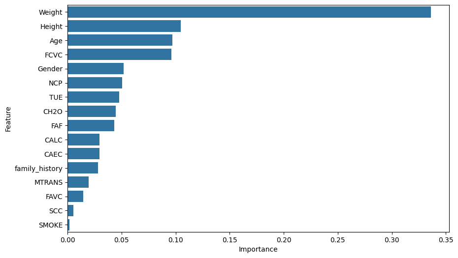

# 🏃 Klasifikasi Tingkat Obesitas Berdasarkan Gaya Hidup

## 📌 Project Overview

Proyek ini bertujuan untuk mengklasifikasikan tingkat obesitas seseorang berdasarkan faktor gaya hidup menggunakan algoritma Machine Learning dengan metodologi **CRISP-DM**.

🔗 **Live Demo:** [Link Hugging Face Space]

📓 **Notebook:** [Link Google Colab]

---

## 👥 Tim

| Nama | NIM |
|-------|-----|
| [Nama Anda] | [NIM Anda] |

---

## 📂 Struktur Repositori

```text
├── app.py
├── obesity_classification.ipynb
├── model_obesity.pkl
├── requirements.txt
├── images/
└── README.md
```

---

# 1. Business Understanding

## Latar Belakang

Obesitas merupakan salah satu masalah kesehatan yang semakin meningkat di berbagai negara. Pola makan, aktivitas fisik, konsumsi air, serta kebiasaan sehari-hari memiliki pengaruh terhadap tingkat obesitas seseorang.

Dengan memanfaatkan Machine Learning, model klasifikasi dapat dibangun untuk membantu mengidentifikasi tingkat obesitas berdasarkan gaya hidup seseorang.

---

## Problem Statement

> Dapatkah tingkat obesitas seseorang diklasifikasikan berdasarkan gaya hidup menggunakan algoritma Machine Learning?

---

## Goals

- Membangun model klasifikasi tingkat obesitas.
- Mengidentifikasi faktor gaya hidup yang mempengaruhi tingkat obesitas.
- Mengembangkan aplikasi web interaktif berbasis Streamlit.

---

## Solution Statement

- **Model Utama:** Random Forest Classifier
- **Metrik Evaluasi:**
  - Accuracy
  - Precision
  - Recall
  - F1-Score

---

# 2. Data Understanding

## Sumber Data

- Dataset : Obesity Levels Prediction Dataset
- Sumber : Kaggle
- Jumlah data : 2.111 baris
- Jumlah fitur : 17 kolom

Dataset dapat diakses melalui:

https://www.kaggle.com/datasets/fatemehmehrparvar/obesity-levels

---

## Deskripsi Fitur

| Fitur | Deskripsi |
|---------|---------|
| Gender | Jenis kelamin |
| Age | Umur |
| Height | Tinggi badan |
| Weight | Berat badan |
| family_history_with_overweight | Riwayat obesitas keluarga |
| FAVC | Konsumsi makanan tinggi kalori |
| FCVC | Konsumsi sayur |
| NCP | Jumlah makan utama per hari |
| CAEC | Kebiasaan ngemil |
| SMOKE | Kebiasaan merokok |
| CH2O | Konsumsi air |
| SCC | Monitoring kalori |
| FAF | Aktivitas fisik |
| TUE | Penggunaan perangkat teknologi |
| CALC | Konsumsi alkohol |
| MTRANS | Transportasi |
| NObeyesdad | Target klasifikasi |

---

## Kelas Target

- Insufficient Weight
- Normal Weight
- Overweight Level I
- Overweight Level II
- Obesity Type I
- Obesity Type II
- Obesity Type III

---

## EDA Findings

- Distribusi data target relatif seimbang.
- Berat badan dan aktivitas fisik memiliki pengaruh besar terhadap tingkat obesitas.
- Riwayat obesitas keluarga juga berkontribusi terhadap klasifikasi.

<p align="center">

<br>
<em>Gambar 1. Distribusi Tingkat Obesitas</em>
</p>

<p align="center">

<br>
<em>Gambar 2. Heatmap Korelasi Fitur Numerik</em>
</p>

---

# 3. Data Preparation

### Encoding Data Kategorikal

```python
le = LabelEncoder()

for column in df.columns:
    if df[column].dtype == 'object':
        df[column] = le.fit_transform(df[column])
```

### Split Dataset

80% data training dan 20% data testing.

```python
X_train, X_test, y_train, y_test = train_test_split(
    X,
    y,
    test_size=0.2,
    random_state=42
)
```

---

# 4. Modeling

## Random Forest Classifier

```python
model = RandomForestClassifier(
    n_estimators=100,
    random_state=42
)

model.fit(X_train, y_train)
```

---

# 5. Evaluation

## Accuracy

Model Random Forest menghasilkan akurasi sebesar:

### **97%**

---

## Classification Report

| Metric | Value |
|----------|------|
| Accuracy | 97% |
| Precision | 97% |
| Recall | 97% |
| F1-Score | 97% |

---

## Confusion Matrix

<p align="center">

<br>
<em>Gambar 3. Confusion Matrix</em>
</p>

---

## Feature Importance

<p align="center">

<br>
<em>Gambar 4. Feature Importance Random Forest</em>
</p>

Fitur yang paling berpengaruh:

1. Weight
2. Height
3. Age
4. FAF
5. FCVC

---

# 6. Deployment

Model dideploy menggunakan:

- Streamlit
- Hugging Face Spaces

---

## Tampilan Aplikasi

<p align="center">

<br>
<em>Gambar 5. Tampilan Aplikasi Obesity Classification</em>
</p>

---

## Menjalankan Secara Lokal

Clone repository:

```bash
git clone [url repository]
```

Install dependency:

```bash
pip install -r requirements.txt
```

Menjalankan aplikasi:

```bash
streamlit run app.py
```

---

🔗 **Live App:** [Link Hugging Face Space]

---

# ⚠ Disclaimer

Hasil prediksi yang dihasilkan oleh aplikasi ini hanya digunakan untuk tujuan edukasi dan penelitian, serta tidak dapat menggantikan diagnosis dari tenaga kesehatan profesional.

---

# 📚 Referensi

1. Obesity Levels Prediction Dataset - Kaggle.
2. Scikit-learn Documentation.
3. Streamlit Documentation.
4. Breiman, L. (2001). Random Forests. Machine Learning, 45(1), 5–32.
