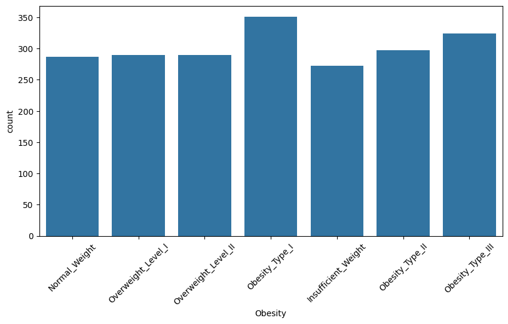
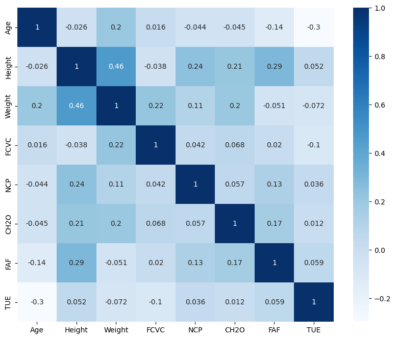
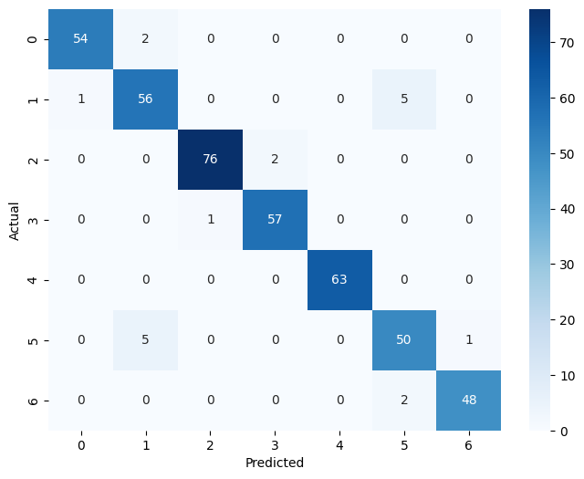

# 🏃 Klasifikasi Tingkat Obesitas Berdasarkan Gaya Hidup

## 📌 Project Overview

Proyek ini bertujuan untuk mengklasifikasikan tingkat obesitas seseorang berdasarkan faktor gaya hidup menggunakan algoritma Machine Learning dengan metodologi **CRISP-DM**.

🔗 **Live Demo:** [Link Hugging Face Space](https://huggingface.co/spaces/kibuu/Klasifikasi_Tingkat_Obesitas_Berdasarkan_Gaya_Hidup_Menggunakan_Algoritma_Random_Forest)

📓 **Notebook:** [Link Google Colab](https://colab.research.google.com/drive/1W3DL_dKhVpKhhiXNcNIv1SgC12XVOYBQ?usp=sharing)

---

## 👥 Tim

| Nama | NIM |
|-------|-----|
| Muhammad Fahmi | 2330511082 |
| Indra | 2330511069 |


---

## 📂 Struktur Repositori

```text
├── app.py
├── obesity_classification.ipynb
├── model_obesity.pkl
├── requirements.txt
├── images/
└── README.md
```

---

# 1. Business Understanding

## Latar Belakang

Obesitas merupakan salah satu masalah kesehatan global yang terus meningkat dari tahun ke tahun. Kondisi ini terjadi akibat penumpukan lemak tubuh yang berlebihan sehingga dapat meningkatkan risiko berbagai penyakit kronis seperti diabetes melitus, hipertensi, penyakit jantung, stroke, dan gangguan metabolisme lainnya. Selain berdampak pada kesehatan fisik, obesitas juga dapat mempengaruhi kualitas hidup seseorang, baik dari segi psikologis maupun sosial.

Tingkat obesitas seseorang dipengaruhi oleh berbagai faktor, seperti pola makan, aktivitas fisik, kebiasaan mengonsumsi makanan tinggi kalori, konsumsi air putih, riwayat obesitas dalam keluarga, serta gaya hidup sehari-hari. Perubahan gaya hidup masyarakat modern yang cenderung kurang aktif secara fisik dan lebih sering mengonsumsi makanan cepat saji menjadi salah satu penyebab meningkatnya angka obesitas di berbagai negara.

Seiring berkembangnya teknologi informasi dan ilmu data, Machine Learning dapat dimanfaatkan untuk membantu menganalisis pola hubungan antara gaya hidup dan tingkat obesitas seseorang. Dengan memanfaatkan data historis yang berisi berbagai faktor gaya hidup, model Machine Learning dapat dilatih untuk mengenali pola tertentu dan melakukan klasifikasi tingkat obesitas secara otomatis. Hasil klasifikasi ini diharapkan dapat menjadi informasi awal yang membantu individu dalam memahami kondisi kesehatannya sehingga dapat mengambil langkah pencegahan maupun perbaikan gaya hidup lebih dini.

Berdasarkan permasalahan tersebut, penelitian ini bertujuan untuk membangun model klasifikasi tingkat obesitas berdasarkan faktor gaya hidup menggunakan algoritma Random Forest. Algoritma ini dipilih karena memiliki kemampuan yang baik dalam menangani data klasifikasi multikelas, mampu mengolah banyak atribut sekaligus, serta menghasilkan performa yang tinggi dalam berbagai kasus klasifikasi.

---

## Problem Statement

Berdasarkan latar belakang yang telah dijelaskan, obesitas merupakan masalah kesehatan yang dipengaruhi oleh berbagai faktor gaya hidup yang saling berkaitan. Banyaknya faktor yang mempengaruhi tingkat obesitas menyebabkan proses identifikasi menjadi lebih kompleks apabila dilakukan secara manual. Oleh karena itu, diperlukan suatu pendekatan yang mampu menganalisis data secara efektif dan menghasilkan klasifikasi tingkat obesitas dengan tingkat akurasi yang baik.

Permasalahan yang akan diselesaikan dalam penelitian ini adalah bagaimana membangun model Machine Learning yang mampu mengklasifikasikan tingkat obesitas seseorang berdasarkan faktor gaya hidup seperti usia, berat badan, tinggi badan, aktivitas fisik, pola makan, konsumsi air, serta kebiasaan sehari-hari lainnya. Selain itu, penelitian ini juga bertujuan untuk mengetahui seberapa baik performa algoritma Random Forest dalam melakukan klasifikasi tingkat obesitas dan mengidentifikasi faktor-faktor yang paling berpengaruh terhadap hasil klasifikasi.

Secara rinci, rumusan masalah dalam penelitian ini adalah sebagai berikut:

Bagaimana membangun model klasifikasi tingkat obesitas berdasarkan faktor gaya hidup menggunakan algoritma Random Forest?
Seberapa baik performa model Random Forest dalam mengklasifikasikan tingkat obesitas berdasarkan metrik Accuracy, Precision, Recall, dan F1-Score?
Faktor gaya hidup apa saja yang memiliki pengaruh paling besar terhadap tingkat obesitas seseorang?
Bagaimana mengimplementasikan model klasifikasi tersebut ke dalam aplikasi berbasis web yang dapat digunakan secara interaktif oleh pengguna?
---

## Goals

- Membangun model klasifikasi tingkat obesitas.
- Mengidentifikasi faktor gaya hidup yang mempengaruhi tingkat obesitas.
- Mengembangkan aplikasi web interaktif berbasis Streamlit.

---

## Solution Statement

- **Model Utama:** Random Forest Classifier
- **Metrik Evaluasi:**
  - Accuracy
  - Precision
  - Recall
  - F1-Score

---

# 2. Data Understanding

## Sumber Data

- Dataset : Obesity Levels Prediction Dataset
- Sumber : Kaggle
- Jumlah data : 2.111 baris
- Jumlah fitur : 17 kolom

Dataset dapat diakses melalui:

https://www.kaggle.com/datasets/fatemehmehrparvar/obesity-levels

---

## Deskripsi Fitur

| Fitur | Deskripsi |
|---------|---------|
| Gender | Jenis kelamin |
| Age | Umur |
| Height | Tinggi badan |
| Weight | Berat badan |
| family_history_with_overweight | Riwayat obesitas keluarga |
| FAVC | Konsumsi makanan tinggi kalori |
| FCVC | Konsumsi sayur |
| NCP | Jumlah makan utama per hari |
| CAEC | Kebiasaan ngemil |
| SMOKE | Kebiasaan merokok |
| CH2O | Konsumsi air |
| SCC | Monitoring kalori |
| FAF | Aktivitas fisik |
| TUE | Penggunaan perangkat teknologi |
| CALC | Konsumsi alkohol |
| MTRANS | Transportasi |
| NObeyesdad | Target klasifikasi |

---

## Kelas Target

- Insufficient Weight
- Normal Weight
- Overweight Level I
- Overweight Level II
- Obesity Type I
- Obesity Type II
- Obesity Type III

---

## EDA Findings

- Distribusi data target relatif seimbang.
- Berat badan dan aktivitas fisik memiliki pengaruh besar terhadap tingkat obesitas.
- Riwayat obesitas keluarga juga berkontribusi terhadap klasifikasi.

<p align="center">

<br>
<em>Gambar 1. Distribusi Tingkat Obesitas</em>
</p>

<p align="center">

<br>
<em>Gambar 2. Heatmap Korelasi Fitur Numerik</em>
</p>

---

# 3. Data Preparation

### Encoding Data Kategorikal

```python
le = LabelEncoder()

for column in df.columns:
    if df[column].dtype == 'object':
        df[column] = le.fit_transform(df[column])
```

### Split Dataset

80% data training dan 20% data testing.

```python
X_train, X_test, y_train, y_test = train_test_split(
    X,
    y,
    test_size=0.2,
    random_state=42
)
```

---

# 4. Modeling

## Random Forest Classifier

```python
model = RandomForestClassifier(
    n_estimators=100,
    random_state=42
)

model.fit(X_train, y_train)
```

---

# 5. Evaluation

## Accuracy

Model Random Forest menghasilkan akurasi sebesar:

### **97%**

---

## Classification Report

| Metric | Value |
|----------|------|
| Accuracy | 97% |
| Precision | 97% |
| Recall | 97% |
| F1-Score | 97% |

---

## Confusion Matrix

<p align="center">

<br>
<em>Gambar 3. Confusion Matrix</em>
</p>

---

## Feature Importance

<p align="center">

<br>
<em>Gambar 4. Feature Importance Random Forest</em>
</p>

Fitur yang paling berpengaruh:

1. Weight
2. Height
3. Age
4. FAF
5. FCVC

---

# 6. Deployment

Model dideploy menggunakan:

- Streamlit
- Hugging Face Spaces

---

## Tampilan Aplikasi

<p align="center">

<br>
<em>Gambar 5. Tampilan Aplikasi Obesity Classification</em>
</p>

---

## Menjalankan Secara Lokal

Clone repository:

```bash
git clone [url repository]
```

Install dependency:

```bash
pip install -r requirements.txt
```

Menjalankan aplikasi:

```bash
streamlit run app.py
```

---

🔗 **Live App:** [Link Hugging Face Space](https://huggingface.co/spaces/kibuu/Klasifikasi_Tingkat_Obesitas_Berdasarkan_Gaya_Hidup_Menggunakan_Algoritma_Random_Forest)

---

# ⚠ Disclaimer

Hasil prediksi yang dihasilkan oleh aplikasi ini hanya digunakan untuk tujuan edukasi dan penelitian, serta tidak dapat menggantikan diagnosis dari tenaga kesehatan profesional.

---

# 📚 Referensi

1. Obesity Levels Prediction Dataset - Kaggle.
2. Scikit-learn Documentation.
3. Streamlit Documentation.
4. Breiman, L. (2001). Random Forests. Machine Learning, 45(1), 5–32.
